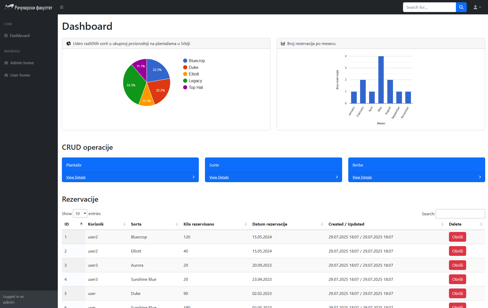

# Getting started

Mock blueberry shop/catalog website built using the laravel framework (ver. 12).
Project built for "Programming web applications" class in college.




## Dependencies
- xampp 8.2.12 (for mysql, php and apache)
- composer (latest for php 8.2.12)
- Node.js & NPM (latest recommended)

## Build & Run
Clone the repository and navigate into the project directory:
```bash
git clone https://github.com/TadejDragojlovic/BlueberryLaravel
cd BlueberryLaravel
```

For Windows users: 
1. open up XAMPP control panel
2. start mysql and apache services
3. run the `start.bat` script

For Linux/MacOS users:
1. open up XAMPP control panel
2. start mysql and apache services
3. run the `start.sh` script